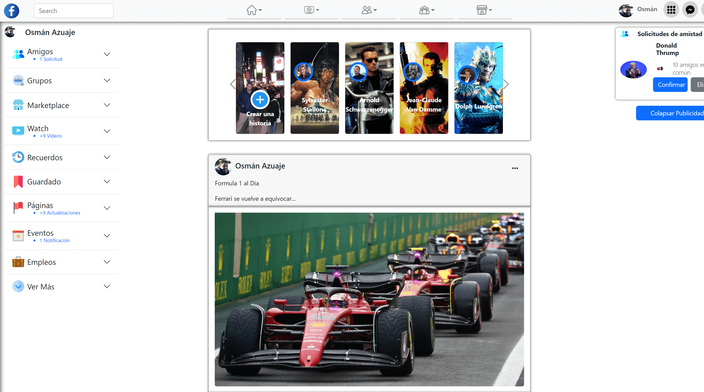

# Facebook-Mockup

Creation of a **Facebook mockup**, with other additional elements, to apply and develop **Bootstrap** knowledge.

## Characteristics:

1. I implement Bootstrap in a Facebook mockup by correctly connecting the necessary *CDNs* (connect the necessary **CSS** and scripts for **Bootstrap** to work correctly).

2. Suggested header for both mobile views and larger devices, use a *single breakpoint* for appearance change.

3. Using the **Bootstrap** classes needed to adjust the *margin* and *padding*.

4. Using **Bootstrap's** *background classes* to color the *buttons*.

5. Group of three columns with the use of *Grid*.

6. In mobile view, only the central column remains visible, the other two are hidden. This also includes the elements of the top bar, only the 5 elements that are in the central part remain visible.

7. *Header* elements converted to a *nav bar*.

8. The *nav* elements, modified to be *dropdowns*.

9. Added a *form* that simulates a *registration form*.

10. The *form fields* are validable, have a *placeholder*, the *inputs* must correspond to the type of data requested *(text, password, email)* In addition to including the* checkbox* in the *form*.

11. Set the *grouped logo* in the *header* to match your *navbar-brand,* as well as the *"search" input.*

12. Added a *Card*. Taking into account the *Header, Content* and *Footer* indicators.

13. Added a *carousel*, with three screens, containing 5 images* (items)*.

14. Programmed in the images or screens of the *Carousel,* that when clicking on them a *Modal window* is displayed.

15. Ready the *button* on the right, activate a *Collapse* content. The *Collapse*content should be below the box that contains the *button.*

16. Prepared the elements in the left column to be *Accordion containers*, which when clicked on them display content.
